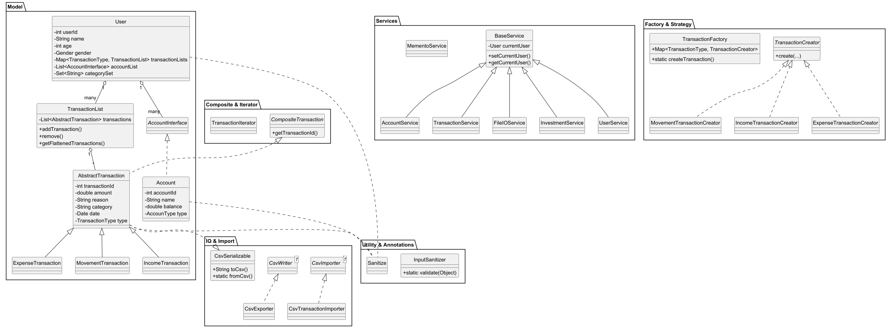

# 💸 Finance Tracker App

## 🧾 Overview

Finance Tracker is a CLI-based Java application for personal financial management. It allows users to manage multiple accounts, track income/expense/movement transactions, categorize spending, and import/export data using CSV.

This MVP focuses on **core financial tracking logic** with testable, secure, extensible code — and is intended as the backend core of a future full-stack dashboard application.

---

## 🛠️ Technologies & Concepts Used

- **Java Collections & Generics**
- **Java I/O (File, CSV)**
- **Logger (Custom Factory)**
- **JUnit 5 + Mockito** (Test suite for service/IO layers)
- **Custom Annotation (`@Sanitize`)**
- **Exception Shielding + Controlled Input Validation**
- **Modular Service Architecture**
- **CLI-based Interface (extensible to GUI/API)**

---

## 🧩 Design Patterns

| Pattern               | Where It’s Used                  |
|----------------------|----------------------------------|
| **Factory**          | `TransactionFactory`             |
| **Abstract Factory** | For `TransactionCreator` logic   |
| **Composite**        | `TransactionList` (holds transactions) |
| **Iterator**         | `TransactionIterator`            |
| **Strategy**         | `TransactionCreator` strategy map |
| **Memento**          | `MementoService` → snapshot/restore users |
| **Builder**          | `IncomeTransactionBuilder` for cleaner construction |
| **Exception Shielding** | All services wrap and log exceptions securely |

---

## 📐 Architecture Diagram (Simplified)

---

## 🧪 Testing

- All **service layers** tested with JUnit and Mockito
- `CsvTransactionImporterTest` validates parsing and edge cases
- `FileIOServiceTest` mocks I/O and checks transaction recording
- `InputSanitizerTest` (suggested): verify annotation-driven rules

---

## ⚠️ Known Limitations

- CLI only — no REST or GUI yet
- No multithreading (could help in file parsing later)
- Some utility classes not fully tested (e.g., `ConsoleUtils`)
- No encryption or authentication on saved users

---

## 🚀 Future Work

This app is built as a **modular MVP** to become the **backend engine of a web-based finance dashboard**.

Planned improvements:
- Replace CLI with **Spring Boot Web Layer**
- Replace Memento persistence with **SQL/NoSQL database**
- Add user authentication + JWT
- Integrate with **React/Vue Dashboard**
- Add export to **PDF/Excel** formats
- Use a full **dependency injection container**

---

## 📂 Sample CSV File

A sample `transactions_sample_50.csv` is provided to test bulk import/export, including valid and invalid lines for robustness.

---

## 👨‍💻 Author

Stefano Bertaccini  
GitHub: [StefanoBertaccini1998](https://github.com/StefanoBertaccini1998)

---

## 🗂️ License

MIT License (or add your university-specific license info here)

