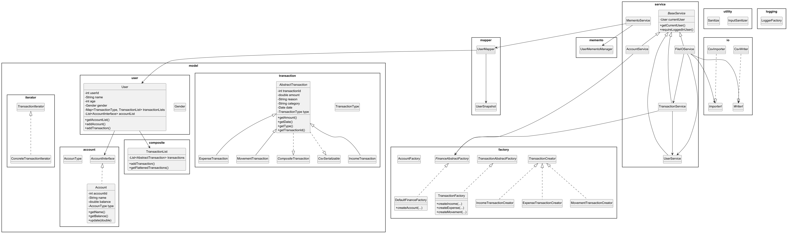

# 💸 Finance Tracker App

## 🧾 Overview

**Finance Tracker** is a modular, CLI-based Java application for personal financial management. It enables users to:

* Create and manage multiple **accounts**
* Record and analyze **Income**, **Expense**, and **Movement** transactions
* Organize financial data through **categories**
* Import/export transactions via **CSV**
* Persist and restore user sessions using the **Memento pattern**

🔧 Designed with clean OOP, SOLID principles, and modularity in mind, the project is structured as a testable backend
MVP, ready for extension into a full-stack dashboard.

---

## 🛠️ Technologies & Features

| Technology                      | Use Case                                                       |
|---------------------------------|----------------------------------------------------------------|
| **Java Collections & Generics** | Strongly typed handling of user, account, and transaction data |
| **Java I/O**                    | File-based persistence, transaction CSV input/output           |
| **Custom Annotations**          | `@Sanitize` provides declarative field validation              |
| **Reflection API**              | Powers dynamic validation using annotations                    |
| **Logging (Singleton pattern)** | Application-wide log file system without interfering with CLI  |
| **JUnit 5 + Mockito**           | Unit testing and mocking for isolation                         |
| **Stream API + Lambdas**        | Filtering, mapping, and transformation of transaction data     |
| **Inversion of Control (IoC)**  | Constructor injection for service decoupling and testability   |
| **Exception Shielding**         | Controlled propagation of errors with CLI-safe messages        |

---

## 🧠 Technology Justifications

- ✅ **Reflection** allows you to write `InputSanitizer` once and use it across all models with annotations — avoiding
  repetitive boilerplate.
- ✅ **Custom Annotations** (`@Sanitize`) enable domain-driven, declarative validation.
- ✅ **Stream API + Lambdas** simplify category filtering and transaction flattening.
- ✅ **Inversion of Control** ensures testability and clean constructor-based dependency injection.
- ✅ **Exception Shielding** prevents internal errors from reaching users while enabling detailed log diagnostics.
- ✅ **Mockito** lets you simulate file or user operations without side effects — essential for IO layer testing.
- ✅ **Singleton LoggerFactory** keeps logs clean, consolidated, and non-intrusive to the CLI experience.

---

## 🧩 Design Patterns Used

| Pattern                 | Implementation                                  | Justification                                                     |
|-------------------------|-------------------------------------------------|-------------------------------------------------------------------|
| **Factory**             | `TransactionFactory`                            | Decouples creation of Income, Expense, Movement objects           |
| **Abstract Factory**    | `DefaultFinanceFactory`                         | Centralized factory for accounts and transactions with validation |
| **Strategy**            | Internal map of creators in transaction factory | Flexible selection of transaction creation logic                  |
| **Composite**           | `TransactionList`,`CompositeTransaction`        | Treats single and grouped transactions uniformly                  |
| **Iterator**            | `TransactionIterator`                           | Navigates hierarchical transaction lists                          |
| **Builder**             | `TransactionBuilder`                            | Constructs transaction entities in a clean, readable way          |
| **Memento**             | `UserSnapshot`, `MementoService`                | Save/restore user sessions via JSON snapshot mechanism            |
| **Singleton**           | `LoggerFactory`                                 | Centralized, file-based logger instance shared app-wide           |
| **Exception Shielding** | All Services                                    | Prevents internal exceptions from leaking to CLI output           |

---

## 🧪 Testing Strategy

| Module               | Covered                                     |
|----------------------|---------------------------------------------|
| `TransactionService` | ✅ Fully unit tested with factory mocks      |
| `AccountService`     | ✅ Includes positive/negative path tests     |
| `CsvImporter/Writer` | ✅ Integration tested with mock + real files |
| `MementoService`     | ✅ Snapshot save/load coverage               |
| `InputSanitizer`     | ✅ Validates all field rules via annotations |
| `LoggerFactory`      | ✅ Tested fallback and log generation        |

> ✨ Test suite is designed for clarity, isolation, and no side effects.

---

## 📐 UML Diagrams

> See `assets/uml/` folder for `.png` and `.puml` files.


### 🧱 Class Diagram Highlights:

* `User` ↔ `AccountInterface`, `TransactionList`
* `AbstractTransaction` ⇨ `IncomeTransaction`, `ExpenseTransaction`, `MovementTransaction`
* `TransactionFactory`, `TransactionCreator`, `DefaultFinanceFactory`
* `LoggerFactory`, `InputSanitizer`, `@Sanitize`

### 🏛️ Architecture:

```
+-------------------------------------------------------------+
|                        CLI Controllers                      |
|-------------------------------------------------------------|
| MainMenuController, UserMenuController, TxMenuController,   |
| AccountMenuController, CsvMenuController                    |
+------------------------------+------------------------------+
                               |
                               v
+-------------------------------------------------------------+
|                           Services                          |
|-------------------------------------------------------------|
| UserService, AccountService, TransactionService,            |
| CsvFileIOService, MementoService                            |
+-----------+--------------------------+----------------------+
            |                          |
            v                          v
+-------------------------+    +-----------------------------+
|      Factories          |    |       Mappers / Formatters |
|-------------------------|    |-----------------------------|
| TransactionFactory      |    | UserMapper, TransactionFmt  |
| AccountFactory          |    | AccountFormatter, etc.      |
+-------------------------+    +-----------------------------+
            |                          |
            v                          v
+-------------------------------------------------------------+
|                         Core Domain                         |
|-------------------------------------------------------------|
| User, AbstractTransaction, IncomeTx, ExpenseTx, MovementTx  |
| AccountInterface, AccountType, TransactionType, Category    |
+-------------------------------------------------------------+
                               |
                               v
+-------------------------------------------------------------+
|                      Utility & Infra Layer                  |
|-------------------------------------------------------------|
| ConsoleUtils, ConsoleStyle, LoggerFactory, InputSanitizer  |
| CSV Reader/Writer, DateFormatUtils, Annotations             |
+-------------------------------------------------------------+

```

---

## 🚧 Known Limitations & Future Work

| ❌ Limitation                                   | 💡 Improvement Suggestion                                                                                  |
| ---------------------------------------------- | ---------------------------------------------------------------------------------------------------------- |
| No multithreading in CSV import                | Use `ExecutorService` to parallelize file parsing and improve performance on large datasets                |
| No REST or GUI interface                       | Extend the CLI backend into a Spring Boot REST API or JavaFX GUI for broader accessibility                 |
| Validation limited to annotations              | Introduce the **Chain of Responsibility** pattern to support multiple validation layers                    |
| No user-level authentication                   | Add login with password hashing and session management                                                     |
| Linear transaction search                      | Implement indexing or category trees for faster transaction querying and filtering                         |
| Supports only CSV format                       | Allow users to choose between CSV, JSON, or XML file formats during import/export                          |
| Data stored as flat JSON                       | Integrate a database (e.g., SQLite, PostgreSQL) for relational storage and better scalability              |
| Missing investment management logic            | Use the **Decorator** pattern to calculate interest or yield over time (e.g., linear or compound growth)   |
| Account balances not updated during CSV import | Design a reconciliation strategy: recalculate balances based on imported transactions                      |
| No undo/redo or state history                  | Implement a command history or versioning mechanism using the **Memento** pattern                          |
| CLI tightly coupled to services                | Introduce service interfaces or ports to support future front-end decoupling (clean architecture approach) |
| No localization or i18n support                | Externalize strings and introduce a locale service for multilingual CLI or GUI support                     |

---


## 📋 Logging Policy

* All system logs (info, warning, error) are written to timestamped files in `/log`
* CLI remains clean: user interaction uses `System.out` only
* Log messages use lazy evaluation (`logger.info(() -> ...)`)
* `LoggerFactory.getSafeLogger(...)` avoids crashes from logging init failures

---

## 📂 Setup & Execution

### Prerequisites:

* Java 17+

### Build & Run:

```bash
git clone https://github.com/StefanoBertaccini1998/finance_tracker_app.git
cd finance_tracker_app
javac -d out $(find . -name "*.java")
java -cp out it.finance.sb.FinanceTrackApplication
```